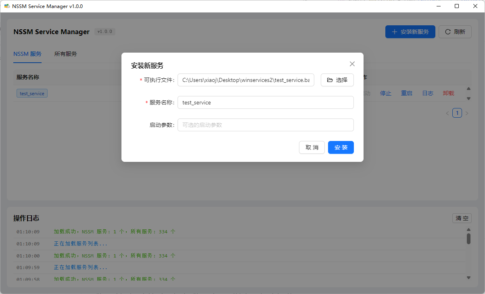
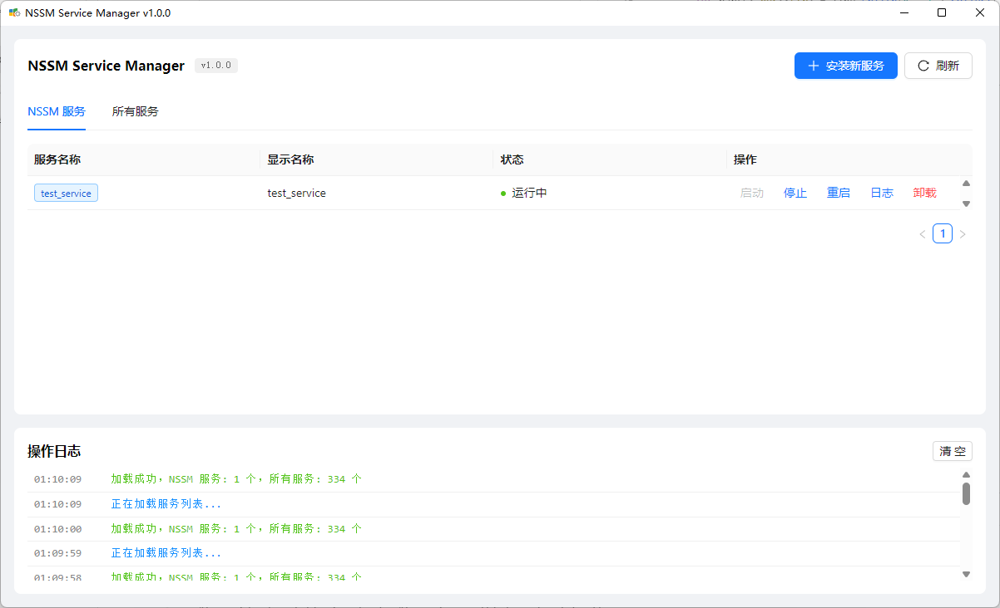
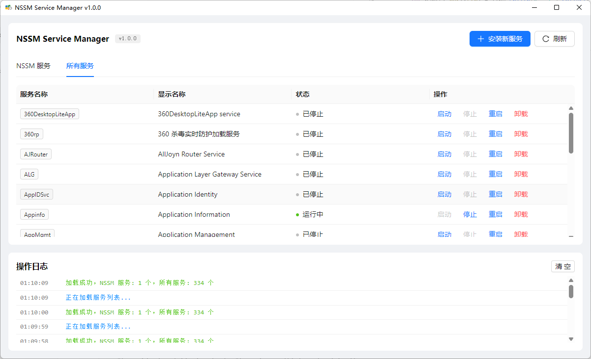

# WinSvc Manager

一个基于 Tauri 构建的 Windows 服务管理工具，封装 NSSM (Non-Sucking Service Manager)，提供简洁的图形化界面来管理 Windows 服务。

可视化包装应用成为一个Windows服务，使其后台运行

## 功能特性

- **服务安装** - 可视化安装 Windows 服务，支持自动解析命令路径和参数
- **服务控制** - 启动、停止、重启服务
- **服务卸载** - 安全卸载已安装的服务
- **服务列表** - 查看 NSSM 安装的服务和系统所有服务
- **操作日志** - 实时记录所有操作历史
- **双架构支持** - 内置 x86 和 x64 版本的 NSSM

## 截图








## 快速开始

### 下载

前往 [Releases](https://github.com/greper/winsvc-manager/releases) 页面下载最新安装包。

### 安装

1. 运行 `winsvc-manager_1.x.x_x64-setup.exe`
2. 按照安装向导完成安装
3. **以管理员身份运行**（管理 Windows 服务需要管理员权限）

## 技术栈

| 组件 | 技术 |
|------|------|
| 框架 | [Tauri 2.x](https://tauri.app/) |
| 前端 | Vue 3 + TypeScript |
| UI 库 | [Ant Design Vue](https://antdv.com/) |
| 后端 | Rust |
| 服务管理 | [NSSM 2.24](https://nssm.cc/) |

## 开发指南

### 环境要求

- Node.js >= 18
- pnpm
- Rust >= 1.70
- Visual Studio Build Tools (Windows)

### 安装依赖

```bash
pnpm install
```

### 开发模式

```bash
pnpm tauri dev
```

### 构建生产版本

```bash
pnpm tauri build
```

构建产物位于 `src-tauri/target/release/bundle/nsis/` 目录。

## 项目结构

```
winsvc-manager/
├── src/                    # Vue 前端代码
│   ├── components/         # Vue 组件
│   ├── App.vue            # 主界面
│   └── types.ts           # TypeScript 类型
├── src-tauri/             # Rust 后端
│   ├── src/
│   │   ├── commands.rs    # Tauri IPC 命令
│   │   ├── nssm.rs        # NSSM 命令封装
│   │   ├── service.rs     # Windows 服务枚举
│   │   └── main.rs        # 应用入口
│   └── resources/         # NSSM 可执行文件
│       ├── win32/nssm.exe
│       └── win64/nssm.exe
└── docs/                  # 设计文档
```

## 使用说明

### 安装服务

1. 点击「安装新服务」按钮
2. 选择或输入可执行文件路径（支持粘贴完整命令，自动解析参数）
3. 服务名称会根据文件名自动生成，可手动修改
4. 可选填写启动参数
5. 点击「安装」完成安装

### 管理服务

- **启动** - 点击服务行的「启动」按钮
- **停止** - 点击服务行的「停止」按钮
- **重启** - 点击服务行的「重启」按钮
- **卸载** - 点击服务行的「卸载」按钮，确认后卸载

## 注意事项

- 本工具需要**管理员权限**运行，否则无法管理服务
- NSSM 已内置在应用中，无需额外安装
- 服务状态列表默认显示所有服务，可通过标签页切换查看

## 许可证

MIT License

## 贡献

欢迎提交 Issue 和 Pull Request！
